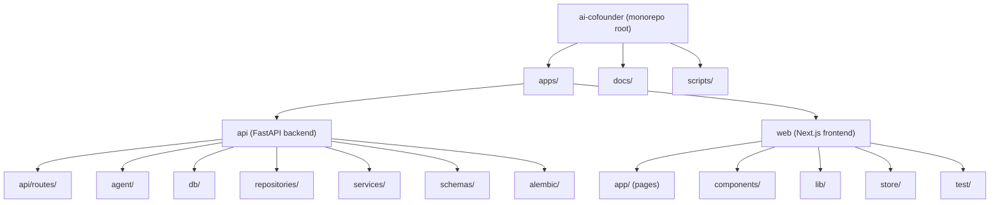

# AI Co-founder -- Project Context

> Auto-generated by init-architect on 2026-04-03T23:43:56. Do not edit manually unless updating conventions.

## 项目愿景

AI Co-founder 是一个产品工作台：通过持续对话帮助用户挖掘想法、收敛方向，逐步沉淀为可执行的 PRD（产品需求文档）。系统扮演"AI 联合创始人"角色，主动追问、挑战假设、引导决策，最终输出结构化 PRD。

## 架构总览

Monorepo 结构，包含两个核心应用模块：

- **apps/api** -- Python FastAPI 后端，提供认证、会话管理、消息流式返回、PRD 导出等 REST/SSE API。
- **apps/web** -- Next.js 15 + React 19 前端，提供登录/注册、工作台会话、对话面板、PRD 实时面板等 UI。

数据库使用 PostgreSQL（通过 SQLAlchemy ORM + Alembic 迁移）。前后端通过 HTTP JSON API + SSE 通信。

## 模块结构图



## 模块索引

| 模块 | 路径 | 语言 | 职责 |
|------|------|------|------|
| API | `apps/api` | Python 3.12+ | 后端服务：认证、会话、消息流、PRD 导出 |
| Web | `apps/web` | TypeScript | 前端应用：登录、工作台、对话、PRD 面板 |

## 技术栈

### 后端 (apps/api)

- Python 3.12+, FastAPI, Uvicorn
- SQLAlchemy 2.0 (ORM), Alembic (迁移)
- PostgreSQL (psycopg driver)
- Pydantic 2.8+ (数据校验)
- python-jose (JWT), passlib/bcrypt (密码哈希)
- sse-starlette (Server-Sent Events)
- pytest + pytest-asyncio (测试)

### 前端 (apps/web)

- Next.js 15, React 19, TypeScript 5.6+
- Zustand 5 (状态管理)
- Tailwind CSS (样式，通过 class utilities)
- Vitest + Testing Library + jsdom (测试)

### 工具链

- pnpm 10 (包管理/monorepo)
- uv (Python 虚拟环境)
- Alembic (数据库迁移)
- PowerShell 脚本 (`scripts/dev.ps1`)

## 运行与开发

### 前置条件

- Node.js, pnpm, Python 3.12+, uv, PostgreSQL (远程或本地 Docker)

### 环境变量

- 根目录 `.env`: `DATABASE_URL`, `AUTH_SECRET_KEY`
- `apps/web/.env.local`: `NEXT_PUBLIC_API_BASE_URL`

### 快速启动

```powershell
# 一键脚本 (需已安装依赖)
powershell -ExecutionPolicy Bypass -File .\scripts\dev.ps1

# 手动启动
python -m uvicorn app.main:app --reload --app-dir apps/api   # 后端 :8000
pnpm dev:web                                                   # 前端 :3000
```

### 数据库迁移

```powershell
cd apps/api && alembic upgrade head && cd ../..
```

### 常用命令

| 命令 | 说明 |
|------|------|
| `pnpm dev:web` | 启动前端开发服务器 |
| `pnpm dev:api` | 启动后端开发服务器 |
| `pnpm test:web` | 前端测试 (Vitest) |
| `pnpm test:api` | 后端测试 (pytest) |
| `pnpm --filter web build` | 前端构建 |

## 测试策略

### 后端

- 框架: pytest + FastAPI TestClient
- 测试数据库: SQLite in-memory (`conftest.py` 注入)
- 覆盖: 健康检查、认证(注册/登录/me)、会话CRUD、消息流、模型、Agent运行时、配置加载
- 目录: `apps/api/tests/`

### 前端

- 框架: Vitest + @testing-library/react + jsdom
- 覆盖: 组件渲染、store 逻辑、页面路由、表单交互
- 目录: `apps/web/src/test/`
- 配置: `apps/web/vitest.config.ts`, setup 文件 `src/test/setup.ts`

## 编码规范

- 后端使用 Python dataclass/Pydantic model，采用 Repository -> Service -> Route 分层架构
- 前端 TypeScript strict mode，路径别名 `@/*` 映射 `./src/*`
- 状态管理: Zustand vanilla store (workspace-store) + create hook store (auth-store, toast-store)
- 样式: Tailwind CSS utility classes，无独立 CSS 文件
- 包管理: pnpm (禁止使用 npm)
- 单文件不超过 500 行
- TypeScript 类型定义内联于使用处，不放独立类型文件 (除 `lib/types.ts` 作为共享接口定义)

## API 端点一览

| 方法 | 路径 | 说明 |
|------|------|------|
| POST | `/api/auth/register` | 用户注册 |
| POST | `/api/auth/login` | 用户登录 |
| GET | `/api/auth/me` | 获取当前用户 |
| GET | `/api/sessions` | 会话列表 |
| POST | `/api/sessions` | 创建会话 |
| GET | `/api/sessions/{id}` | 获取会话快照 |
| PATCH | `/api/sessions/{id}` | 更新会话标题 |
| DELETE | `/api/sessions/{id}` | 删除会话 |
| POST | `/api/sessions/{id}/messages` | 发送消息 (SSE 流式返回) |
| POST | `/api/sessions/{id}/export` | 导出 PRD Markdown |
| GET | `/api/health` | 健康检查 |

## 前端路由

| 路由 | 组件 | 说明 |
|------|------|------|
| `/login` | AuthForm (login mode) | 登录页 |
| `/register` | AuthForm (register mode) | 注册页 |
| `/workspace` | WorkspaceEntry | 工作台入口/创建会话 |
| `/workspace/[sessionId]` | WorkspaceSessionShell | 工作台会话页 |

## 数据模型

5 张核心表:

- `users` -- 用户 (id, email, password_hash)
- `project_sessions` -- 会话 (id, user_id, title, initial_idea, created_at, updated_at)
- `project_state_versions` -- 项目状态版本 (id, session_id, version, state_json)
- `prd_snapshots` -- PRD 快照 (id, session_id, version, sections)
- `conversation_messages` -- 对话消息 (id, session_id, role, content, message_type, meta)

## AI 使用指引

- 修改后端代码时，注意 Repository -> Service -> Route 三层分离，不要跳层
- 修改前端组件时，状态逻辑在 store 中处理，组件只负责渲染和事件分发
- Agent 模块 (`apps/api/app/agent/`) 当前是简单规则引擎，后续会接入 LLM
- SSE 事件协议: `message.accepted` -> `action.decided` -> `assistant.delta` -> `assistant.done`，可选 `prd.updated`
- 测试: 后端用 SQLite in-memory 替代真实 DB，前端用 jsdom 模拟浏览器环境

## 变更记录 (Changelog)

| 日期 | 操作 | 说明 |
|------|------|------|
| 2026-04-03 | CREATED | init-architect 首次生成项目文档 |
